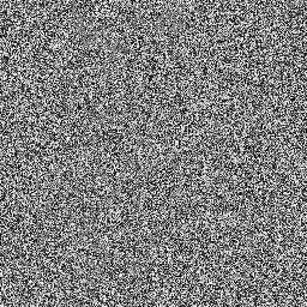

# Reversible Data Hiding (c++ implementation)

### How to build

`cmake --build`

### How to use

1. Example encryption: `reversible_data_hiding_run.exe --mode encrypt --image-path ..\..\..\..\images\lena_gray.bmp --result-path ..\..\..\..\images\lena_gray-enc.bmp --enc-key-file ..\..\..\..\example_encrypt_key.bin`  


2. Example decryption: `reversible_data_hiding_run.exe --mode decrypt --image-path ..\..\..\..\images\lena_gray-enc.bmp --result-path ..\..\..\..\images\lena_gray-dec.bmp --enc-key-file ..\..\..\..\example_encrypt_key.bin`  


3. Example data embedding: `reversible_data_hiding_run.exe --mode embed --image-path ..\..\..\..\images\lena_gray-enc.bmp --result-path ..\..\..\..\images\lena_gray-enc-embed.bmp --embed-key-file ..\..\..\..\example_embed_key.bin --data-file ..\..\..\..\example_data_to_embed.bin`  

### Performance

- Default realization (pixel-by-pixel encryption):

```none
-------------------------------------------------------------------------
Benchmark                               Time             CPU   Iterations
-------------------------------------------------------------------------
EncryptAirplane_512x512_bench        3.32 ms         3.25 ms          154
EncryptCrowd_512x512_bench           3.30 ms         3.29 ms          204
EncryptMan_512x512_bench             3.25 ms         2.98 ms          236
EncryptBoat_512x512_bench            3.26 ms         3.18 ms          187
EncryptLiberty_1024x1024_bench       13.1 ms         13.2 ms           64
EncryptMan_2048x2048_bench           52.1 ms         51.6 ms           10
EncryptMan_4096x4096_bench            212 ms          214 ms            3
```

- Threaded realization:

```none
-------------------------------------------------------------------------
Benchmark                               Time             CPU   Iterations
-------------------------------------------------------------------------
EncryptAirplane_512x512_bench        13.6 ms         2.42 ms          265
EncryptCrowd_512x512_bench           13.2 ms         1.72 ms          299
EncryptMan_512x512_bench             13.2 ms         1.74 ms          448
EncryptBoat_512x512_bench            13.3 ms         1.59 ms          747
EncryptLiberty_1024x1024_bench       15.7 ms         1.72 ms          299
EncryptMan_2048x2048_bench           28.7 ms         4.53 ms          100
EncryptMan_4096x4096_bench           74.6 ms         11.8 ms           41
```

- Hybrid approach

```none
-------------------------------------------------------------------------
Benchmark                               Time             CPU   Iterations
-------------------------------------------------------------------------
EncryptAirplane_512x512_bench        3.57 ms         3.20 ms          166
EncryptCrowd_512x512_bench           3.37 ms         3.44 ms          236
EncryptMan_512x512_bench             3.38 ms         3.53 ms          195
EncryptBoat_512x512_bench            3.40 ms         3.49 ms          179
EncryptLiberty_1024x1024_bench       13.8 ms         13.4 ms           50
EncryptMan_2048x2048_bench           29.8 ms         6.00 ms          112
EncryptMan_4096x4096_bench           74.1 ms         11.7 ms           56
```

### Program modules

- ~~Image matrix Class~~
- ~~Image Loader - Loads bmp image and converts it to the matrix of colours~~
- ~~Encryptor - Encrypts image using XOR encryption~~
- Data Hider
  - ~~Pre-encoder~~
  - ~~Block Classificator~~
  - Compressor (~~RLC~~ + LSB)
  - Embedder
- Data Extractor
  - Data Extractor
  - Image Decryptor
  - Image Recoverer

### Libraries

- BOOST - program options
- Cimg - BMP opening/saving/showing
- eigen - math operations
- gtest - google testing library
- google benchmark - benchmarking library
